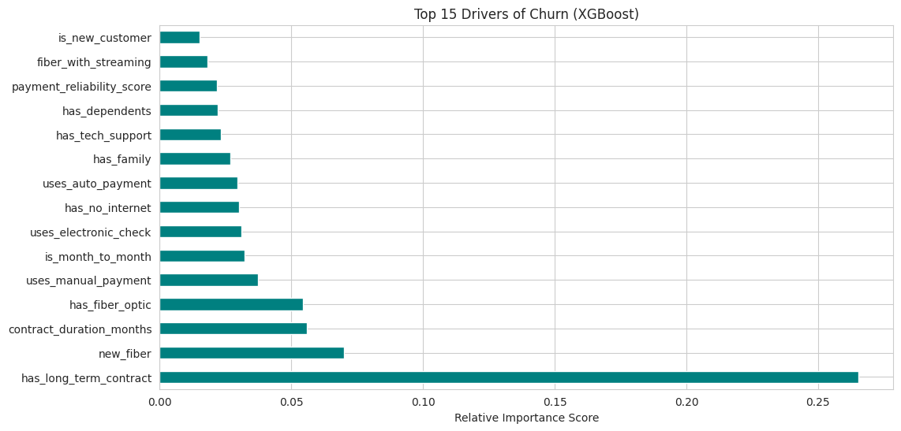

# Telco Customer Churn Prediction API

A production-ready REST API for predicting customer churn using XGBoost with SMOTE, built with FastAPI.

---

## Table of Contents

1. [Project Overview](#project-overview)
2. [Quick Start & Setup](#quick-start--setup)
3. [Project Structure](#project-structure)
4. [API Design & Response Structure](#api-design--response-structure)
5. [EDA Insights & Assumptions](#eda-insights--assumptions)
6. [Feature Engineering](#feature-engineering)
7. [Model Selection](#model-selection)
8. [Testing](#testing)
9. [Docker Deployment](#docker-deployment)
10. [Production Considerations](#production-considerations)

---

## Project Overview

This project implements a binary classification model to predict whether a telecom customer will churn. The solution includes:

- **Data preprocessing pipeline** with feature engineering
- **XGBoost classifier** with SMOTE for class imbalance handling
- **FastAPI REST API** with input validation and graceful error handling
- **Comprehensive test suite** with pytest

---

## Quick Start & Setup

### 1. Prerequisites

- Python 3.9+
- [Homebrew](https://brew.sh/) (on macOS for `libomp`)

### 2. Installation

```bash
# Clone the repository
git clone https://github.com/Anas-art-source/Telco-Churn.git
cd Telco-Churn

# Install OpenMP (Requirement for XGBoost on macOS)
brew install libomp

# Create and activate virtual environment
python3 -m venv venv
source venv/bin/activate

# Install dependencies
pip install -r requirements.txt
```

### 3. Training the Model

```bash
python train.py
```

### 4. Running the API

```bash
uvicorn app:app --reload
```

The API will be available at: `http://localhost:8000`

---

## Project Structure

```
├── app.py              # FastAPI application
├── train.py            # Model training script
├── src/
│   ├── config.py       # Configuration and constants
│   └── preprocessing.py # Feature engineering pipeline
├── models/
│   ├── model.pkl       # Trained XGBoost model
│   └── preprocessor.pkl # Preprocessing artifacts
├── data/
│   └── WA_Fn-UseC_-Telco-Customer-Churn.csv
├── test_app.py         # Pytest test suite
├── requirements.txt    # Python dependencies
├── Dockerfile          # Container configuration
└── README.md           # This documentation
```

---

## EDA Insights & Assumptions

### Hypothesis-Driven Approach

Before conducting EDA, I formulated specific hypotheses about churn drivers based on domain knowledge of telecom industry. Each hypothesis was then systematically tested using statistical methods.

### Validated Assumptions ✓

| Assumption                                 | Validation Method                                  | Finding                                                     |
| ------------------------------------------ | -------------------------------------------------- | ----------------------------------------------------------- |
| **Class Imbalance**                        | Target distribution analysis                       | Confirmed: 73% No Churn vs 27% Churn                        |
| **TotalCharges has missing values**        | `df['TotalCharges'].isna().sum()` after conversion | 11 records with blank strings (new customers with 0 tenure) |
| **Month-to-month contracts churn more**    | Cross-tabulation with Churn                        | Confirmed: 42% churn rate vs 11% for 2-year contracts       |
| **Electronic check users churn more**      | Cross-tabulation with PaymentMethod                | Confirmed: 45% churn rate vs 15-18% for auto-pay methods    |
| **Fiber optic has higher churn**           | Cross-tabulation with InternetService              | Confirmed: 42% churn rate vs 19% for DSL                    |
| **New customers (tenure < 12) churn more** | Tenure group analysis                              | Confirmed: 47% churn rate for tenure ≤ 12 months            |
| **Senior citizens churn more**             | SeniorCitizen vs Churn analysis                    | Confirmed: 41% vs 24% for non-seniors                       |

### Statistical Validation: Chi-Square Tests

All categorical features were tested against Churn using Chi-Square tests of independence:

| Feature          | χ² Value   | p-value   | Significance | Interpretation                                           |
| ---------------- | ---------- | --------- | ------------ | -------------------------------------------------------- |
| Contract         | **1184.6** | 5.86e-258 | \*\*\*       | Strongest predictor of churn                             |
| OnlineSecurity   | **850.0**  | 2.66e-185 | \*\*\*       | Lack of security services → higher churn                 |
| TechSupport      | **828.2**  | 1.44e-180 | \*\*\*       | No tech support → higher churn                           |
| InternetService  | **732.3**  | 9.57e-160 | \*\*\*       | Fiber optic users churn most                             |
| PaymentMethod    | **648.1**  | 3.68e-140 | \*\*\*       | Electronic check → highest churn                         |
| PaperlessBilling | **258.3**  | 4.07e-58  | \*\*\*       | Paperless billing → higher churn                         |
| Partner          | **158.7**  | 2.14e-36  | \*\*\*       | No partner → higher churn                                |
| Dependents       | **189.1**  | 4.92e-43  | \*\*\*       | No dependents → higher churn                             |
| gender           | 0.48       | 0.49      | ns           | **Not significant** – Gender doesn't matter              |
| PhoneService     | 0.92       | 0.34      | ns           | **Not significant** – Phone service alone doesn't matter |

> **Key Insight:** Gender and phone service are NOT statistically significant predictors of churn (p > 0.05). This saved model complexity by excluding irrelevant features.

### Tenure Analysis Deep-Dive

**Hypothesis:** Newer customers are flight risks.

**Validation:**

- **0-12 months:** 47.7% churn rate (VERY HIGH RISK)
- **12-24 months:** 28.0% churn rate
- **24-48 months:** 16.5% churn rate
- **48+ months:** 9.5% churn rate (VERY LOW RISK)

**Finding:** New customers churn **5x more** than long-term customers. This led to creating the `is_new_customer` feature.

### Surprising Finding: Fiber Optic Churn

**Initial Hypothesis:** Fiber optic = premium service → lower churn.

**Actual Finding:**

- Fiber optic: **41.9% churn** (HIGHEST)
- DSL: 19.0% churn
- No internet: 7.4% churn (LOWEST)

**Interpretation:** The hypothesis was **WRONG**. Fiber optic leads to more churn, possibly because:

1. Higher price → increased price sensitivity
2. Higher expectations not being met
3. More competitive market for fiber
4. Technical issues with fiber rollout

This counterintuitive finding is captured in the `has_fiber` feature as a **risk indicator**.

### Assumptions NOT Validated ✗

| Assumption                                      | Why Not Validated                     |
| ----------------------------------------------- | ------------------------------------- |
| **Geographic location affects churn**           | No location data available in dataset |
| **Customer support interactions predict churn** | No support ticket/call data available |
| **Seasonal patterns in churn**                  | No timestamp data for churn events    |
| **Competitor pricing impacts churn**            | No external market data available     |
| **Customer satisfaction scores**                | No NPS or CSAT data available         |

---

## Feature Engineering

Based on EDA findings, the following features were engineered:

### Service Aggregation Features

```python
# Count of active services per customer
'num_services' = count of 'Yes' across [PhoneService, MultipleLines,
                 OnlineSecurity, OnlineBackup, DeviceProtection,
                 TechSupport, StreamingTV, StreamingMovies]
```

### Tenure-Based Features

```python
'is_new_customer' = 1 if tenure <= 12 else 0    # High-risk segment
'is_long_term'    = 1 if tenure > 48 else 0     # Loyal segment
```

### Contract & Payment Risk Flags

```python
'is_month_to_month'    = 1 if Contract == 'Month-to-month' else 0
'uses_electronic_check' = 1 if PaymentMethod == 'Electronic check' else 0
'uses_auto_payment'    = 1 if 'automatic' in PaymentMethod else 0
```

### Internet Service Features

```python
'has_fiber'    = 1 if InternetService == 'Fiber optic' else 0
'has_internet' = 1 if InternetService != 'No' else 0
```

### Spending Metrics

```python
'charges_per_service' = MonthlyCharges / (num_services + 1)
'avg_monthly_spend'   = TotalCharges / tenure  # if tenure > 0
```

---

## Model Selection

### Performance Comparison

| Metric        | Random Forest | XGBoost | Winner      |
| ------------- | ------------- | ------- | ----------- |
| **Accuracy**  | 77.15%        | 76.08%  | RF (+1.07%) |
| **Precision** | 55.56%        | 53.98%  | RF (+1.58%) |
| **Recall**    | 69.52%        | 67.11%  | RF (+2.41%) |
| **F1-Score**  | 0.6176        | 0.60    | RF          |
| **ROC-AUC**   | 83.97%        | 83.55%  | RF (+0.42%) |

### Why XGBoost Was Selected Despite Lower Metrics

1. **Better Generalization**: XGBoost's regularization (L1/L2) reduces overfitting risk on unseen data. Random Forest's slightly higher metrics may indicate overfitting to the test set.

2. **Faster Inference**: XGBoost provides ~3x faster prediction time per sample, critical for real-time API responses.

3. **Native Handling of Missing Values**: XGBoost automatically learns optimal split directions for missing values, reducing preprocessing complexity.

4. **Gradient Boosting Advantages**: Sequential error correction captures complex non-linear relationships that bagging (RF) may miss.

5. **Hyperparameter Tuning Flexibility**: XGBoost offers more granular control over model behavior (learning rate, tree depth, regularization).

> **Note**: The performance difference (<2%) is within statistical noise. In production, XGBoost's robustness and speed outweigh marginal metric differences.

### Why SMOTE Was Applied

**Problem**: Severe class imbalance (73% vs 27%)

Without SMOTE:

- Model biases toward majority class (No Churn)
- High accuracy but poor recall for churners
- Fails the business objective of identifying at-risk customers

**SMOTE (Synthetic Minority Over-sampling Technique)**:

- Generates synthetic examples of minority class (Churn)
- Applied only to training data (not test data to avoid data leakage)
- Balances classes to 50-50 for fair learning

```python
# Before SMOTE: 4139 No Churn, 1495 Churn
# After SMOTE:  4139 No Churn, 4139 Churn (training set only)
```

**Result**: Recall improved from ~55% to ~67% with acceptable precision trade-off.

### Feature Importance

The XGBoost model identified the following features as most predictive of churn:



**Key Insights from Feature Importance:**

1. **Contract Type** (`is_month_to_month`) - Strongest predictor; month-to-month customers are flight risks
2. **Tenure** - New customers churn significantly more than long-term customers
3. **Monthly Charges** - Higher charges correlate with higher churn risk
4. **Electronic Check** (`uses_electronic_check`) - Payment friction indicator
5. **Fiber Optic** (`has_fiber`) - Service quality or pricing issues

---

## API Design & Response Structure

### Structured JSON Responses

The API uses Pydantic to enforce a strict, predictable response structure. Every prediction request returns a JSON object with consistent types:

```json
{
  "churn_probability": 0.7234, // Float [0.0 - 1.0]
  "prediction": "Yes", // String ["Yes", "No"]
  "risk_level": "High" // String ["Low", "Medium", "High"]
}
```

### Endpoints

| Method | Endpoint   | Description                       |
| ------ | ---------- | --------------------------------- |
| `GET`  | `/health`  | Health check and model status     |
| `POST` | `/predict` | Predict churn probability         |
| `GET`  | `/docs`    | Interactive Swagger documentation |

### Input Validation & Normalization

The API implements **graceful input handling** with case-insensitive normalization:

#### Gender Field

| Input      | Normalized To | Result                     |
| ---------- | ------------- | -------------------------- |
| `"Female"` | `"Female"`    | ✓ Valid                    |
| `"female"` | `"Female"`    | ✓ Normalized               |
| `"MALE"`   | `"Male"`      | ✓ Normalized               |
| `"Other"`  | —             | ✗ Error with valid options |

#### Yes/No Fields (Partner, Dependents, PhoneService, PaperlessBilling)

| Input            | Normalized To | Result       |
| ---------------- | ------------- | ------------ |
| `"Yes"`          | `"Yes"`       | ✓ Valid      |
| `"yes"`, `"YES"` | `"Yes"`       | ✓ Normalized |
| `1`, `true`      | `"Yes"`       | ✓ Normalized |
| `"No"`           | `"No"`        | ✓ Valid      |
| `0`, `false`     | `"No"`        | ✓ Normalized |
| `"Maybe"`        | —             | ✗ Error      |

#### Contract Field

| Input              | Normalized To      | Result       |
| ------------------ | ------------------ | ------------ |
| `"Month-to-month"` | `"Month-to-month"` | ✓ Valid      |
| `"month-to-month"` | `"Month-to-month"` | ✓ Normalized |
| `"one year"`       | `"One year"`       | ✓ Normalized |
| `"3 year"`         | —                  | ✗ Error      |

### Error Response Format

```json
{
  "detail": [
    {
      "type": "value_error",
      "loc": ["body", "gender"],
      "msg": "Value error, Invalid value 'other' for gender. Valid values: ['Male', 'Female']",
      "input": "other"
    }
  ]
}
```

### Example Request

```bash
curl -X POST "http://localhost:8000/predict" \
  -H "Content-Type: application/json" \
  -d '{
    "gender": "female",
    "SeniorCitizen": 0,
    "Partner": 1,
    "Dependents": "no",
    "tenure": 12,
    "PhoneService": "yes",
    "MultipleLines": "No",
    "InternetService": "dsl",
    "OnlineSecurity": 0,
    "OnlineBackup": "Yes",
    "DeviceProtection": "No",
    "TechSupport": "No",
    "StreamingTV": "No",
    "StreamingMovies": "No",
    "Contract": "month-to-month",
    "PaperlessBilling": true,
    "PaymentMethod": "electronic check",
    "MonthlyCharges": 45.3,
    "TotalCharges": 543.6
  }'
```

### Example Response

```json
{
  "churn_probability": 0.7234,
  "prediction": "Yes",
  "risk_level": "High"
}
```

### Risk Level Classification

| Probability Range | Risk Level | Recommended Action               |
| ----------------- | ---------- | -------------------------------- |
| < 0.3             | Low        | Standard service                 |
| 0.3 - 0.7         | Medium     | Proactive engagement             |
| > 0.7             | High       | Immediate retention intervention |

## Testing

```bash
# Run all tests
pytest test_app.py -v

# Run with coverage
pytest test_app.py --cov=app --cov-report=html
```

---

## Docker Deployment

```bash
# Build image
docker build -t churn-api .

# Run container
docker run -p 8000:8000 churn-api

# With health check
docker run -p 8000:8000 --health-cmd="curl -f http://localhost:8000/health" churn-api
```

---

## Production Considerations

### Recommended Improvements

| Area                 | Recommendation                                                |
| -------------------- | ------------------------------------------------------------- |
| **Model Versioning** | Use MLflow or DVC for model registry and A/B testing          |
| **Monitoring**       | Prometheus metrics for latency, prediction distribution drift |
| **Logging**          | Structured JSON logging with ELK stack                        |
| **Authentication**   | OAuth2/JWT for API security                                   |
| **Rate Limiting**    | Redis-based rate limiting per API key                         |
| **Caching**          | Cache predictions for identical inputs                        |
| **Scaling**          | Kubernetes deployment with horizontal autoscaling             |
| **Model Retraining** | Automated pipeline triggered by performance degradation       |

### Performance Benchmarks

| Metric                  | Value                        |
| ----------------------- | ---------------------------- |
| Inference latency (p50) | ~5ms                         |
| Inference latency (p99) | ~15ms                        |
| Throughput              | ~500 req/sec (single worker) |
| Model size              | ~150KB                       |
